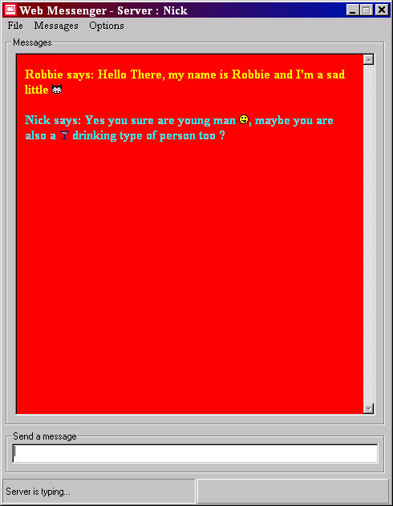



## Web Messenger 1\.2\.2

### Description

***UPDATE***

Hi, it's only me again with another update to web messenger. So if your not fed up with my programs by now then here it is, now with changeable colour settings for your messages and also a few bug fixes.

If you find any bugs then please report them to me, as im trying to make this program reasonably good.

Thanks allot, please vote and leave comments if you download this, any feedback is worth it.

Nick :)
 
### More Info
 

             |
---                |---
**Submitted On**   |2001-02-14 12:12:38
**By**             |[Niknak\!\! \<OLD\>](https://github.com/Planet-Source-Code/PSCIndex/blob/master/ByAuthor/niknak-old.md)
**Level**          |Advanced
**User Rating**    |5.0 (15 globes from 3 users)
**Compatibility**  |VB 6\.0
**Category**       |[Miscellaneous](https://github.com/Planet-Source-Code/PSCIndex/blob/master/ByCategory/miscellaneous__1-1.md)
**World**          |[Visual Basic](https://github.com/Planet-Source-Code/PSCIndex/blob/master/ByWorld/visual-basic.md)
**Archive File**   |[CODE\_UPLOAD149652142001\.zip](https://github.com/Planet-Source-Code/niknak-old-web-messenger-1-2-2__1-21006/archive/master.zip)

